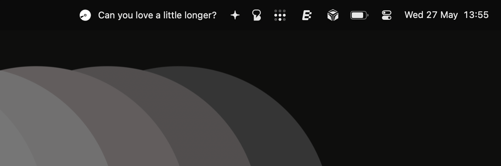

# Vinyl

<div align="center">
  
</div>

A native, lightweight macOS menu bar app that displays synchronized scrolling lyrics for **Apple Music** and **Spotify**.


## Features
- 🎵 **Dual Player Support:** Seamlessly detects whether Apple Music or Spotify is playing.
- 📜 **Native & LRCLIB Support:** Queries Apple Music natively for lyrics or falls back to `lrclib.net` to automatically fetch synchronized lyrics (`[mm:ss.xx]`).
- ✨ **Smooth Marquee Scrolling:** Dynamically and smoothly scrolls long lyric lines within your menu bar without jittering or overflowing into the notch.
- ⚙️ **Customizable Preferences:** Adjust the marquee scroll speed, tracking polling interval, and menu bar text appearance from a native SwiftUI settings window.
- 🌓 **Adaptive Icon:** Uses a custom vinyl logo that dynamically adapts to macOS Light and Dark modes.
- 🔋 **Efficient Polling:** Minimal CPU footprint utilizing native `NSAppleScript` bridging and AppKit `NSStatusItem`.

## Installation

### Homebrew (Recommended)
You can easily install Vinyl using Homebrew:
```bash
brew tap VariableThe/tap
brew install --cask vinyl
```

### Manual Download
Alternatively, you can download the latest pre-built release:
1. Go to the [Releases](https://github.com/VariableThe/Vinyl/releases/latest) page.
2. Download the `Vinyl.zip` file.
3. Extract the ZIP file and drag `Vinyl.app` into your `Applications/` folder.
4. Double-click to run!

> **Note:** Upon first run, macOS will prompt you to grant `Vinyl` permission to control "System Events" and "Music"/"Spotify". Please click **Allow** so the app can fetch currently playing metadata.

## Build from Source

You will need the Swift toolchain installed (comes with Xcode Command Line Tools).

1. Clone the repository:
   ```bash
   git clone https://github.com/VariableThe/Vinyl.git
   cd Vinyl
   ```

2. Build and bundle the app using the provided `Makefile`:
   ```bash
   make app
   ```

3. The command will output a `Vinyl.app` folder. Simply drag this to your `Applications/` folder and double-click to run!

## Development

To run the app directly from source in development mode:
```bash
swift run
```

## Credits
Concept inspired by [LYRA](https://github.com/Dai-Ski/LYRA) and [boring.notch](https://github.com/TheBoredTeam/boring.notch).
